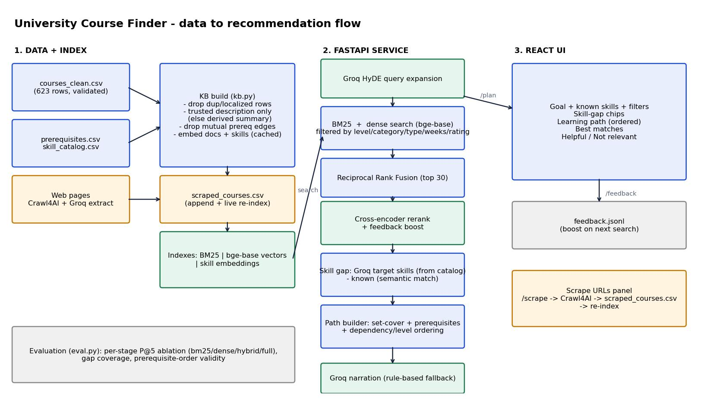

# University Course Finder

FastAPI + React app: type a learning goal, get matching courses, a skill-gap analysis and an ordered learning path. Groq (LLM) refines the analysis; Crawl4AI adds courses scraped from the web.

 - design notes in [docs/DESIGN.md](docs/DESIGN.md)

## Setup

**Backend** (Python 3.10+)
```bash
cd backend
python -m venv .venv && source .venv/bin/activate      # Windows: .venv\Scripts\activate
pip install -r requirements.txt
crawl4ai-setup                                          # installs the browser Crawl4AI needs
cp .env.example .env                                    # put your GROQ_API_KEY in it (free at console.groq.com)
uvicorn main:app --reload --port 8000
```
**Frontend** (Node 18+), in a second terminal
```bash
cd frontend && npm install && npm run dev               # http://localhost:5173
```
Without a Groq key the app still works (rule-based skill gap and explanations, no query expansion). If the embedding/reranker models can't be downloaded it falls back to BM25 and prints a warning. First start downloads ~0.5 GB of models once; document vectors are then cached in `backend/data/.emb_cache.pkl`.

**Retrieval pipeline:** BM25 + bge-base dense search -> Reciprocal Rank Fusion -> cross-encoder rerank -> feedback boost. Groq adds HyDE query expansion. Models are configurable: `EMBED_MODEL`, `RERANK_MODEL`, `SKILL_SIM` in `.env`; `MODELS=off` forces BM25 only.

## Agent (LangGraph)
`backend/graph.py` runs the request as a LangGraph state machine: **analyze -> retrieve -> (weak? rewrite -> retrieve) -> skill_gap -> path -> (gap left? widen -> path) -> narrate**. It self-corrects (rewrites the query or relaxes filters when results are weak, widens to all categories when skills are uncovered), verifies prerequisite order, and returns a `trace` shown in the UI under **Agent steps**. `GET /graph` returns the graph as Mermaid. See `docs/agent_graph.jpg`.

## Usage

In the UI there is a single box: type a goal in plain language and the agent works out the topic, the skills you already have, and your level from the sentence. Try:

- *I want to learn data science from the basics. Which courses should I start with?*
- *I know Python and SQL. What courses should I take next to move into machine learning?*
- *I want to learn cloud computing but I don't know which prerequisite courses I need.*
- *Can you suggest a learning path from beginner to advanced data analytics?*

You get matching courses with reasons and prerequisites, the skill gap (green = you have it, amber = to learn), and an ordered path (Foundation -> Advanced). The thumbs buttons send feedback that re-ranks later searches.

API equivalent:
```bash
curl -X POST localhost:8000/plan -H 'Content-Type: application/json' \
  -d '{"goal":"I know Python and SQL. What courses should I take next to move into machine learning?"}'
```
| Endpoint | Purpose |
|---|---|
| `POST /plan` | `{goal}` (optional `known_skills`, `filters`) runs the agent: search + skill gap + learning path + trace |
| `GET /graph` | agent graph as Mermaid |
| `POST /search` | retrieval only, with filters |
| `POST /feedback` | `{course_id, query, helpful}` |
| `POST /scrape` | `{urls:[...]}` -> Crawl4AI -> new courses indexed instantly |
| `GET /meta` | filter options and status |

**Scraping from the CLI:** `python scraper.py https://... https://...` then restart the API. Results go to `backend/data/scraped_courses.csv` (delete it to undo). Note: `courses_clean.csv` has no URLs, so scraping is how you attach live pages; sites that block bots (Coursera often does) may return nothing.

## Evaluation
`python eval.py` prints mean P@5 per retrieval stage (bm25 / dense / hybrid / full), then per-query P@5, skill-gap coverage and prerequisite-order validity for 8 representative queries. Measured here with BM25 only (models could not be downloaded in my sandbox): P@5 = 0.825, gap coverage 1.00, prerequisite order valid 8/8. **Run it on your machine to see the dense / hybrid / full numbers** and tune `SKILL_SIM` and the reranker choice.

## Layout
`backend/kb.py` data + retrieval · `graph.py` LangGraph agent · `planner.py` gap + path helpers · `llm.py` Groq · `scraper.py` Crawl4AI · `main.py` API · `eval.py` · `frontend/src/App.jsx` UI
